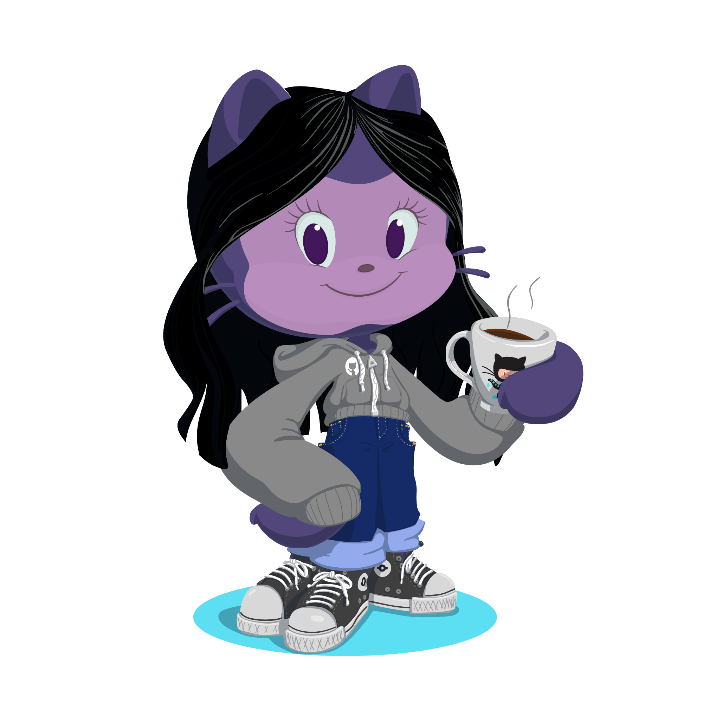

## Hello, Devs!!

### Eu sou a Pamela 👋

- 💻 Tenho 24 anos, sou estudante de Analise e Desenvolvimento de Sistemas em Curitiba/PR, nerd de carteirinha, adoro estudar coisas novas e contruir novos projetos.

- ✨ Buscando me aperfeiçoar em desenvolvimento front-end e transformar ideias em interfaces bonitas e funcionais.

- 🎨 Quando não estou codando, você pode me encontrar inventando algo como pintura ou criando personagens de amigurumis.

- 📚 Adoro ler livros e maratonar séries no meu tempo livre.

### 🖥️ Ferramentas e Tecnologias:

 

## Contatos:
 

 
  
   

 

##

<a href="https://github.com/PCantaruti">

##
<picture>
  <source media="(prefers-color-scheme: dark)" srcset="https://raw.githubusercontent.com/platane/platane/output/github-contribution-grid-snake-dark.svg">
  <source media="(prefers-color-scheme: light)" srcset="https://raw.githubusercontent.com/platane/platane/output/github-contribution-grid-snake.svg">
  
</picture>

